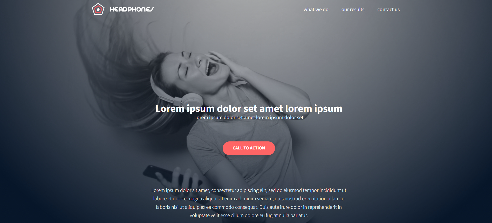

# 🎧 Holberton Headphones – Fully Responsive Landing Page

A clean and responsive landing page built entirely from scratch using **HTML** and **CSS**, based on a Figma design provided by Holberton School.  
📱[Live demo](https://khezamitaha.github.io/holbertonschool-headphones/).

 This project showcases my ability to translate a professional UI design into accessible, pixel-perfect code — without relying on frameworks like Bootstrap or JavaScript.



---

## 🔍 Overview

This project was part of Holberton's “Implement a design from scratch” module. It emphasizes:

- 🎨 Precision layout from a **Figma prototype**
- 🧠 Mastery of **HTML5 and CSS3**
- 📱 **Responsive design** across desktop, tablet, and mobile (switches at 480px width)
- 🦾 Accessibility best practices
- 📂 Clean, semantic code structure

---

## ✅ Features

- **Pixel-perfect implementation** of a real-world UI design
- **Responsive layout** using media queries
- **Custom font integration** and icon support
- **Modern layout techniques** (Flexbox)
- **No external frameworks** (pure CSS, no Bootstrap)
- **No JavaScript**

---

## 📁 Project Structure

```

├── index.html
├── styles.css
├── images/
│   └── \[all assets used]
├── fonts/
│   └── \[custom font files]

````

---

## 📐 Figma Design

- Designed by **Nicolas Philippot (UI/UX)** and **Guillaume Salva (CTO)**
- [Figma design link live](https://www.figma.com/design/2VJi7kzjheQdpLmtCJ7pue/Holberton-School---Headphone-company--Copy-?node-id=0-362&t=cXNS3ID0eK8fOlx3-0)

---

## 🛠️ Key Skills Demonstrated

- Figma-to-code conversion
- Responsive web design
- Layout structuring using Flexbox
- CSS architecture and reusability
- Accessibility-aware development

---

## 🏁 How to Run

1. Clone the repository:
   ```bash
   git clone https://github.com/KhezamiTaha/holbertonschool-headphones.git
   cd holbertonschool-headphones


2. Open `index.html` in your browser.


---

## 📸 Screenshots

### 🖥️ Responsive layout  


---

## 📬 Contact

Feel free to reach out via [email@example.com](mailto:email@example.com) or through [LinkedIn](https://linkedin.com/in/yourprofile) for feedback or collaboration.

---

## 👨‍💻 Author

**\[Khezami Taha]**
[Portfolio](https://yourportfolio.com) | [LinkedIn](https://linkedin.com/in/yourprofile) | [GitHub](https://github.com/yourusername)
